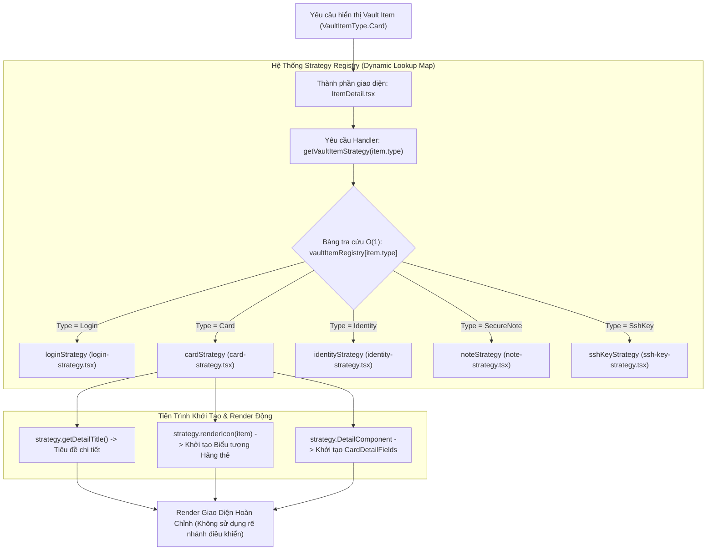
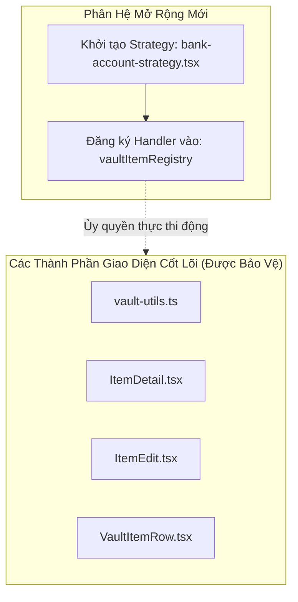

# Tài Liệu Kiến Trúc: Strategy Registry Pattern trong Mô-đun Vault

Tài liệu này mô tả chi tiết thiết kế kiến trúc, lý thuyết nền tảng và cơ chế thực thi của mô hình **Strategy Registry Pattern** được áp dụng cho tính năng quản lý Vault Item trong hệ thống Gistwarden.

---

## 1. Cơ Sở Lý Thuyết & Bản Chất Kỹ Thuật (Architectural Rationale)

Việc chuyển đổi kiến trúc từ mô hình **Static Control Flow Branching** (Rẽ nhánh điều khiển tĩnh) sang **Dynamic Dispatch & Polymorphism** (Đa hình động) giải quyết các hạn chế tồn đọng của mã nguồn ban đầu dựa trên các nguyên lý thiết kế phần mềm cốt lõi:

### 1.1. Ứng Dụng First-Class Citizen trong TypeScript
Trong ngôn ngữ TypeScript/JavaScript, hàm (Functions) và giao diện SolidJS (Components) được coi là đối tượng hạng nhất (**First-Class Citizens**). Điều này cho phép đóng gói trực tiếp cấu trúc render UI và các hàm xử lý logic thành thuộc tính của các đối tượng Strategy (`VaultItemStrategy`):

```typescript
export const cardStrategy: VaultItemStrategy = {
  type: VaultItemType.Card,
  renderIcon: (item) => <CardBrandIcon brand={item.card.brand} />,
  DetailComponent: CardDetailFields,
  EditComponent: CardEditFields,
};
```

### 1.2. Chuyển Đổi Từ Control Flow Branching Sang O(1) Lookup Table
- **Mô hình cũ (Static Control Flow)**: Các thành phần UI cấp cao (`ItemDetail`, `ItemEdit`, `VaultItemRow`) phụ thuộc trực tiếp vào kiểu dữ liệu cụ thể (`VaultItemType`), dẫn đến việc duy trì các chuỗi cấu trúc điều khiển `switch-case` và `if-else` phức tạp, vi phạm nguyên lý **Single Responsibility Principle (SRP)**.
- **Mô hình mới (Registry-based Dynamic Dispatch)**: Các lớp giao diện hoạt động như các thành phần trừu tượng (**Abstract Shell Containers**), được cách ly hoàn toàn khỏi logic cụ thể của từng loại dữ liệu (**Encapsulation & Loose Coupling**). 

Hành vi được ủy quyền hoàn toàn cho Strategy Handler thông qua bảng tra cứu trung tâm (**Lookup Table** với độ phức tạp truy xuất O(1)):

```tsx
const strategy = getVaultItemStrategy(item.type);

return (
  <div>
    <Header title={strategy.getDetailTitle()} />
    {strategy.renderIcon(item)}
    <strategy.DetailComponent item={item} onCopy={handleCopy} />
  </div>
);
```

Cơ chế này loại bỏ hoàn toàn độ phức tạp chu trình (**Cyclomatic Complexity**), giảm thiểu các rủi ro phát sinh lỗi trong quá trình thực thi.

---

## 2. Sơ Đồ Luồng Thực Thi Dạng Dọc (Execution Flowchart)

Dưới đây là sơ đồ luồng thực thi động từ thời điểm nhận yêu cầu người dùng cho đến khi khởi tạo giao diện tương ứng với loại dữ liệu `VaultItemType.Card`:



---

## 3. Khả Năng Mở Rộng Theo Nguyên Lý Open-Closed (OCP)

Sơ đồ thể hiện tiến trình tích hợp một kiểu dữ liệu mới (ví dụ: `BankAccount`) mà không làm ảnh hưởng đến mã nguồn giao diện hiện tại:



---

## 4. Bảng So Sánh Đánh Giá Kiến Trúc

| Tiêu Chí Đánh Giá | Kiến Trúc Control Flow Cũ | Kiến Trúc Strategy Registry Mới |
| :--- | :--- | :--- |
| **Cơ chế phân phối xử lý** | Rẽ nhánh thủ công (`switch-case` / `if-else`) | Dynamic Polymorphism qua Registry Lookup Table O(1) |
| **Mức độ phụ thuộc mã nguồn** | Thắt chặt (Tight Coupling) tại 12+ điểm | Phân rã hoàn toàn (Loose Coupling & Isolation) |
| **Tuân thủ Nguyên lý OCP** | Thất bại (Phải sửa đổi mã nguồn nhiều vị trí) | Đạt tiêu chuẩn (Thêm module mới độc lập không sửa code cũ) |
| **Tính an toàn Kiểu dữ liệu** | Phụ thuộc vào việc kiểm soát mã nguồn thủ công | Đảm bảo tính nhất quán bắt buộc qua `VaultItemStrategy` Interface |

---

## 5. Quy Trình Chuẩn Hóa Khi Mở Rộng Tính Năng

Khi tích hợp kiểu dữ liệu Vault mới vào hệ thống:
1. **Khởi tạo Strategy Handler**: Tạo tệp tin strategy mới triển khai giao diện `VaultItemStrategy`.
2. **Đăng ký vào Registry**: Thêm cặp khóa-giá trị tương ứng vào `vaultItemRegistry` trong `vault-item-registry.ts`.
3. **Hoàn tất tích hợp**: Hệ thống tự động nhận diện và phân phối luồng xử lý cho tất cả các màn hình hiển thị danh sách, chi tiết và chỉnh sửa.
